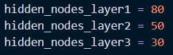
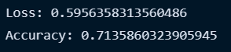

# Neural Network Charity Analysis

## Overview

This project sought to create a neural network to create a binary classifier that is capable of predicting whether applicants to Alphabet Soup's grant program will be successful if funded.

### Purpose

Our friend Beks has been tasked by Alphabet Soup to create a model that can predict the success of applicants to Alphabet Soup's grant program that receive funding. This was accomplished by the creation of neural network that could efficiently sift through the data and classify applicants as 'successful' or 'unsuccessful'.

## Results

### Data Preprocessing
- We consider the 'IS_SUCCESSFUL' column as our target variable, since this is what we hope to determine with our neural network.
- We consider 'APPLICATION_TYPE', 'AFFILIATION', 'CLASSIFICATION', 'USE_CASE', 'ORGANIZATION', 'INCOME_AMT', and 'SPECIAL_CONSIDERATIONS' to be features of the model.
- 'ASK_AMT' and 'STATUS' are not considered features or targets, and thus were removed from consideration in the model. Additionally, once the categorical variables were encoded in the dataset, we removed 'SPECIAL_CONSIDERATIONS_N' since it provided the same information as 'SPECIAL_CONSIDERATIONS_Y'.

### Compiling, Training, and Evaluating the Model
- For this neural netkwork model, we selected 3 layers, with 80, 50, and 30 nodes respectively, for a total of 150 nodes. Initially, we determined to use 2 layers of 80 and 50 nodes each, since that was 3 times as many nodes as there were features in the model. However, while optimizing the model, we added another layer of 30 nodes in an attempt to increase the model's accuracy. 
- Unfortunately, we were unable to achieve the target accuracy of 75%. The closest we were able to get was ~71.4%, as seen below: 
- In order to increase model performance, we changed many things about the model, including:
  - Adding a third hidden layer of 30 nodes
  - Dropping 'ASK_AMT', 'STATUS', and 'SPECIAL_CONSIDERATIONS_N' from the dataframe
  - Replacing any 'APPLICATION_TYPE' with less than 700 counts with 'Other', rather than with less than 1000 counts
  - Changing the activation function of the hidden layers from 'relu' to 'sigmoid'

## Summary
Summarize the overall results of the deep learning model

### Recommendations
Recommend for how a different model could solve this classification problem. Explain your recommendation.
